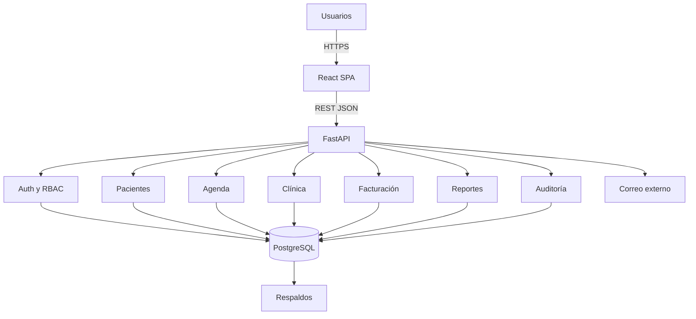

# Dossier técnico ejecutable: Plataforma Clínica Horizonte

> Documento maestro para agentes de ingeniería como Codex o Antigravity. Define alcance, arquitectura, contratos, estructura del repositorio, seguridad, pruebas y criterios de término.

**Versión:** 1.0  
**Fecha base del dossier original:** 22 de septiembre de 2026  
**Estado:** Especificación lista para implementación  
**Fuente funcional:** dossier de planificación `270926.docx`

---

## 1. Mandato para el agente

Construir un monorepo funcional, reproducible y documentado para una plataforma web clínica con:

- Frontend SPA en React + TypeScript + Vite.
- Backend REST en Python + FastAPI.
- PostgreSQL como base de datos relacional.
- SQLAlchemy 2 y Alembic para persistencia y migraciones.
- Autenticación JWT, renovación de sesión y autorización RBAC.
- OpenAPI 3.1 generado por FastAPI y documentación Swagger UI/ReDoc.
- Dockerfiles y Docker Compose para desarrollo y despliegue.
- Pruebas unitarias, integración y E2E.
- Auditoría de operaciones sensibles, respaldos y observabilidad básica.

### Reglas de ejecución

1. No inventar requisitos clínicos fuera de este documento.
2. Implementar primero el camino crítico: autenticación, pacientes, agenda y atención.
3. Mantener los contratos de API como fuente de verdad.
4. No almacenar contraseñas, tokens, secretos ni datos reales en Git.
5. Usar datos sintéticos en semillas y pruebas.
6. Cada cambio debe incluir pruebas, migración cuando corresponda y actualización de documentación.
7. No declarar una tarea terminada si no cumple su criterio de aceptación y la definición de terminado.
8. Ante ambigüedad, elegir la alternativa más simple, segura y reversible, y registrarla en `docs/adr/`.

---

## 2. Contexto y alcance

Clínica Horizonte atiende aproximadamente 180 pacientes por día y necesita centralizar pacientes, agenda, atenciones, diagnósticos, tratamientos, documentos, facturación y reportes. La solución debe separar responsabilidades, restringir el acceso por rol y mantener trazabilidad.

### Objetivo

Entregar una plataforma modular que permita:

- Registrar y actualizar pacientes.
- Consultar disponibilidad, reservar, reprogramar y cancelar horas.
- Registrar atenciones, diagnósticos, tratamientos y observaciones.
- Gestionar facturación básica asociada a paciente y atención.
- Consultar reportes administrativos.
- Administrar usuarios, roles y permisos.
- Auditar accesos y modificaciones sensibles.

### Fuera de alcance inicial

- Integraciones con aseguradoras, laboratorios o receta electrónica.
- Telemedicina y videollamadas.
- Aplicaciones móviles nativas.
- Firma electrónica avanzada.
- Interoperabilidad HL7/FHIR.
- Contabilidad completa o pasarela de pago.

Estas capacidades solo se incorporarán mediante una nueva decisión de arquitectura y ampliación explícita del contrato.

---

## 3. Actores y permisos

| Rol | Capacidades principales |
|---|---|
| `admin` | Usuarios, roles, permisos, configuración y auditoría. |
| `doctor` | Consultar ficha autorizada; registrar atenciones, diagnósticos y tratamientos. |
| `health_professional` | Consultar antecedentes y registrar información clínica autorizada. |
| `receptionist` | Pacientes, contacto, disponibilidad y reservas. |
| `billing` | Facturas, estados de cobro y consultas administrativas. |
| `support` | Salud del sistema y diagnóstico técnico, sin acceso al contenido clínico. |
| `patient` | Sus datos, reservas y documentos habilitados. |

### Matriz mínima RBAC

| Recurso | admin | doctor | health_professional | receptionist | billing | support | patient |
|---|---:|---:|---:|---:|---:|---:|---:|
| Usuarios/roles | RW | - | - | - | - | R técnico | - |
| Pacientes | RW | R | R | RW | R limitada | - | R propio |
| Agenda | RW | R propia | R propia | RW | R | - | RW propia |
| Atenciones | R | RW propia | RW autorizada | - | R mínima | - | R propia habilitada |
| Diagnósticos/tratamientos | R | RW propia | según permiso | - | - | - | R propio habilitado |
| Facturas | R | - | - | R estado | RW | - | R propia |
| Reportes | R | R clínico limitado | - | R operativo | R financiero | métricas técnicas | - |
| Auditoría | R | - | - | - | - | R técnica sin contenido | - |

`R` = lectura; `W` = escritura. La autorización debe validarse en backend, nunca solo en la interfaz.

---

## 4. Historias de usuario y aceptación

### HU-01 Gestión de pacientes

Como personal administrativo, quiero registrar y actualizar pacientes para mantener información de contacto vigente.

- Identificador personal único.
- Campos obligatorios validados.
- Actualización restringida por permisos.
- Cambios registrados en auditoría.
- Listado paginado con búsqueda y filtros.

### HU-02 Gestión de horas médicas

Como funcionario o paciente, quiero consultar y gestionar horas para organizar las atenciones.

- Mostrar profesional, especialidad, fecha, hora y estado.
- Impedir doble reserva mediante restricción transaccional.
- Permitir reserva, reprogramación y cancelación según rol.
- Registrar historial de estados.

### HU-03 Atención clínica

Como médico, quiero registrar diagnósticos y tratamientos para mantener el historial clínico.

- Asociar atención con paciente y profesional.
- Registrar motivo, observaciones, diagnósticos y tratamientos.
- Restringir creación/edición clínica.
- Conservar auditoría; no realizar borrado físico de registros clínicos.

### HU-04 Reportes

Como administrador, quiero consultar indicadores operativos para apoyar la gestión.

- Filtrar por rango de fechas.
- Consultar atenciones, horas y facturación.
- Exportación CSV opcional en una segunda iteración.
- Acceso restringido y consultas paginadas o agregadas.

---

## 5. Arquitectura

### Estilo

Monolito modular cliente-servidor. Es preferible a microservicios para la primera versión debido al alcance y a la necesidad de mantener transacciones consistentes.



### Decisiones

- API versionada bajo `/api/v1`.
- UUID como identificador público.
- Fechas y horas almacenadas con zona horaria; intercambio ISO 8601.
- Respuestas y errores JSON consistentes.
- Borrado lógico donde sea necesario; los registros clínicos deben conservar trazabilidad.
- Transacciones para reserva de horas y operaciones compuestas.
- Backend organizado por módulos de dominio, no por tipos de archivo globales.

---

## 6. Stack propuesto

### Backend

- Python 3.13 o versión estable compatible definida en el repositorio.
- FastAPI, Pydantic 2, SQLAlchemy 2, Alembic.
- PostgreSQL y driver `psycopg`.
- `pwdlib[argon2]` o equivalente mantenido para hash de contraseñas.
- PyJWT o biblioteca compatible para tokens.
- Pytest, pytest-asyncio, HTTPX y Testcontainers o base PostgreSQL efímera.
- Ruff y mypy.

### Frontend

- React, TypeScript y Vite.
- React Router.
- TanStack Query para estado remoto.
- React Hook Form + Zod para formularios.
- Cliente TypeScript generado desde OpenAPI.
- Vitest + Testing Library; Playwright para E2E.
- ESLint y Prettier.

### Infraestructura

- Docker y Docker Compose.
- Nginx para servir frontend en producción y actuar como reverse proxy si se adopta esa topología.
- GitHub Actions para CI.
- Logs estructurados a stdout.
- Endpoints de salud para orquestación.

Las versiones exactas deben fijarse en lockfiles y renovarse mediante PR controlado.

---

## 7. Estructura del monorepo

```text
clinica-horizonte/
├── AGENTS.md
├── README.md
├── Makefile
├── compose.yaml
├── compose.prod.yaml
├── .env.example
├── .gitignore
├── docs/
│   ├── architecture.md
│   ├── security.md
│   ├── operations.md
│   ├── api/openapi.yaml
│   └── adr/0001-monolito-modular.md
├── backend/
│   ├── Dockerfile
│   ├── pyproject.toml
│   ├── alembic.ini
│   ├── alembic/
│   ├── app/
│   │   ├── main.py
│   │   ├── core/{config,security,logging}.py
│   │   ├── db/{base,session}.py
│   │   ├── common/{errors,pagination,audit}.py
│   │   └── modules/
│   │       ├── auth/
│   │       ├── users/
│   │       ├── patients/
│   │       ├── appointments/
│   │       ├── encounters/
│   │       ├── billing/
│   │       ├── reports/
│   │       └── audit/
│   └── tests/{unit,integration}/
├── frontend/
│   ├── Dockerfile
│   ├── package.json
│   ├── src/
│   │   ├── app/
│   │   ├── api/generated/
│   │   ├── features/
│   │   ├── components/
│   │   └── routes/
│   └── tests/
├── e2e/
│   └── tests/
└── scripts/
    ├── wait-for-db.sh
    ├── backup-db.sh
    └── restore-db.sh
```

Cada módulo backend debe contener, según necesidad: `models.py`, `schemas.py`, `repository.py`, `service.py`, `router.py`, `permissions.py` y pruebas.

---

## 8. Modelo de datos mínimo

### Entidades

- `roles(id, name, description, created_at)`
- `permissions(id, code, description)`
- `role_permissions(role_id, permission_id)`
- `users(id, email, password_hash, status, role_id, created_at, updated_at)`
- `patients(id, personal_identifier, first_names, last_names, birth_date, phone, email, address, created_at, updated_at)`
- `professionals(id, user_id, specialty, status)`
- `appointments(id, professional_id, patient_id, starts_at, ends_at, status, cancellation_reason, version, created_at, updated_at)`
- `appointment_status_history(id, appointment_id, from_status, to_status, changed_by, changed_at)`
- `encounters(id, appointment_id, patient_id, professional_id, occurred_at, reason, notes, status, created_at, updated_at)`
- `diagnoses(id, encounter_id, description, diagnosed_at)`
- `treatments(id, encounter_id, description, instructions, starts_on, ends_on)`
- `invoices(id, patient_id, encounter_id, issued_at, amount, currency, status)`
- `audit_events(id, actor_user_id, action, resource_type, resource_id, metadata_json, ip_hash, created_at)`
- `refresh_tokens(id, user_id, token_hash, expires_at, revoked_at, created_at)`

### Restricciones críticas

- `users.email` y `patients.personal_identifier` únicos.
- `amount >= 0`.
- `ends_at > starts_at`.
- Evitar solapamiento de agenda de un profesional mediante restricción de exclusión PostgreSQL o bloqueo transaccional equivalente.
- Estados controlados con enum o `CHECK`.
- Índices para correo, identificador, profesional/fecha, paciente/fecha y auditoría/fecha.
- Relaciones con claves foráneas explícitas.

### Estados sugeridos

- Usuario: `active`, `inactive`, `locked`.
- Hora: `available`, `reserved`, `confirmed`, `completed`, `cancelled`, `no_show`.
- Atención: `draft`, `finalized`, `amended`.
- Factura: `pending`, `paid`, `cancelled`, `overdue`.

---

## 9. Convenciones de API

- Base URL: `/api/v1`.
- `Content-Type: application/json`.
- Autenticación: `Authorization: Bearer <access_token>`.
- Paginación: `page`, `page_size`; máximo configurable.
- Filtros explícitos y ordenamiento con allowlist.
- `Idempotency-Key` recomendado para reservas y creación de facturas.
- Identificador de correlación: aceptar/generar `X-Request-ID`.
- No exponer trazas internas ni datos sensibles en errores.

### Formato de error

```json
{
  "error": {
    "code": "APPOINTMENT_CONFLICT",
    "message": "La hora ya no está disponible.",
    "details": [],
    "request_id": "uuid"
  }
}
```

### Códigos esperados

- `200` consulta/actualización exitosa.
- `201` recurso creado.
- `204` operación sin cuerpo.
- `400` solicitud inválida.
- `401` no autenticado.
- `403` sin permiso.
- `404` recurso inexistente o no visible.
- `409` conflicto de unicidad, estado o agenda.
- `422` validación de esquema.
- `429` límite de solicitudes.
- `500` error controlado con ID de correlación.

---

## 10. Catálogo de endpoints

### Autenticación

- `POST /api/v1/auth/login`
- `POST /api/v1/auth/refresh`
- `POST /api/v1/auth/logout`
- `GET /api/v1/auth/me`

### Pacientes

- `GET /api/v1/patients`
- `POST /api/v1/patients`
- `GET /api/v1/patients/{patient_id}`
- `PATCH /api/v1/patients/{patient_id}`

### Profesionales y agenda

- `GET /api/v1/professionals`
- `GET /api/v1/appointments`
- `POST /api/v1/appointments`
- `GET /api/v1/appointments/{appointment_id}`
- `PATCH /api/v1/appointments/{appointment_id}`
- `POST /api/v1/appointments/{appointment_id}/cancel`

### Atenciones

- `GET /api/v1/encounters`
- `POST /api/v1/encounters`
- `GET /api/v1/encounters/{encounter_id}`
- `PATCH /api/v1/encounters/{encounter_id}`
- `POST /api/v1/encounters/{encounter_id}/finalize`
- `POST /api/v1/encounters/{encounter_id}/diagnoses`
- `POST /api/v1/encounters/{encounter_id}/treatments`

### Facturación y reportes

- `GET /api/v1/invoices`
- `POST /api/v1/invoices`
- `PATCH /api/v1/invoices/{invoice_id}`
- `GET /api/v1/reports/operations`
- `GET /api/v1/reports/billing`

### Administración y operación

- `GET/POST/PATCH /api/v1/admin/users[...]`
- `GET/POST/PATCH /api/v1/admin/roles[...]`
- `GET /api/v1/admin/audit-events`
- `GET /health/live`
- `GET /health/ready`

---

## 11. OpenAPI 3.1 inicial

FastAPI debe generar el contrato desde modelos y rutas. En CI se exportará a `docs/api/openapi.yaml` y se comprobará que esté sincronizado.

```yaml
openapi: 3.1.0
info:
  title: Clínica Horizonte API
  version: 1.0.0
  description: API para pacientes, agenda, atenciones y facturación.
servers:
  - url: http://localhost:8000
    description: Desarrollo local
tags:
  - name: Auth
  - name: Patients
  - name: Appointments
  - name: Encounters
  - name: Billing
  - name: Reports
paths:
  /api/v1/auth/login:
    post:
      tags: [Auth]
      operationId: login
      requestBody:
        required: true
        content:
          application/json:
            schema: {$ref: '#/components/schemas/LoginRequest'}
      responses:
        '200':
          description: Sesión iniciada
          content:
            application/json:
              schema: {$ref: '#/components/schemas/TokenPair'}
        '401': {$ref: '#/components/responses/Unauthorized'}
  /api/v1/patients:
    get:
      tags: [Patients]
      operationId: listPatients
      security: [{bearerAuth: []}]
      parameters:
        - {$ref: '#/components/parameters/Page'}
        - {$ref: '#/components/parameters/PageSize'}
        - name: query
          in: query
          schema: {type: string, maxLength: 100}
      responses:
        '200':
          description: Página de pacientes
          content:
            application/json:
              schema: {$ref: '#/components/schemas/PatientPage'}
        '403': {$ref: '#/components/responses/Forbidden'}
    post:
      tags: [Patients]
      operationId: createPatient
      security: [{bearerAuth: []}]
      requestBody:
        required: true
        content:
          application/json:
            schema: {$ref: '#/components/schemas/PatientCreate'}
      responses:
        '201':
          description: Paciente creado
          content:
            application/json:
              schema: {$ref: '#/components/schemas/Patient'}
        '409':
          description: Identificador duplicado
  /api/v1/appointments:
    post:
      tags: [Appointments]
      operationId: createAppointment
      security: [{bearerAuth: []}]
      parameters:
        - name: Idempotency-Key
          in: header
          schema: {type: string, maxLength: 100}
      requestBody:
        required: true
        content:
          application/json:
            schema: {$ref: '#/components/schemas/AppointmentCreate'}
      responses:
        '201':
          description: Reserva creada
          content:
            application/json:
              schema: {$ref: '#/components/schemas/Appointment'}
        '409':
          description: Conflicto de agenda
components:
  securitySchemes:
    bearerAuth:
      type: http
      scheme: bearer
      bearerFormat: JWT
  parameters:
    Page:
      name: page
      in: query
      schema: {type: integer, minimum: 1, default: 1}
    PageSize:
      name: page_size
      in: query
      schema: {type: integer, minimum: 1, maximum: 100, default: 20}
  schemas:
    LoginRequest:
      type: object
      additionalProperties: false
      required: [email, password]
      properties:
        email: {type: string, format: email}
        password: {type: string, minLength: 8, maxLength: 128}
    TokenPair:
      type: object
      required: [access_token, refresh_token, token_type, expires_in]
      properties:
        access_token: {type: string}
        refresh_token: {type: string}
        token_type: {type: string, const: bearer}
        expires_in: {type: integer}
    PatientCreate:
      type: object
      additionalProperties: false
      required: [personal_identifier, first_names, last_names, birth_date]
      properties:
        personal_identifier: {type: string, minLength: 3, maxLength: 30}
        first_names: {type: string, minLength: 1, maxLength: 100}
        last_names: {type: string, minLength: 1, maxLength: 100}
        birth_date: {type: string, format: date}
        phone: {type: [string, 'null'], maxLength: 30}
        email: {type: [string, 'null'], format: email}
        address: {type: [string, 'null'], maxLength: 250}
    Patient:
      allOf:
        - {$ref: '#/components/schemas/PatientCreate'}
        - type: object
          required: [id, created_at, updated_at]
          properties:
            id: {type: string, format: uuid}
            created_at: {type: string, format: date-time}
            updated_at: {type: string, format: date-time}
    PatientPage:
      type: object
      required: [items, page, page_size, total]
      properties:
        items: {type: array, items: {$ref: '#/components/schemas/Patient'}}
        page: {type: integer}
        page_size: {type: integer}
        total: {type: integer}
    AppointmentCreate:
      type: object
      additionalProperties: false
      required: [professional_id, patient_id, starts_at, ends_at]
      properties:
        professional_id: {type: string, format: uuid}
        patient_id: {type: string, format: uuid}
        starts_at: {type: string, format: date-time}
        ends_at: {type: string, format: date-time}
    Appointment:
      allOf:
        - {$ref: '#/components/schemas/AppointmentCreate'}
        - type: object
          required: [id, status]
          properties:
            id: {type: string, format: uuid}
            status:
              type: string
              enum: [available, reserved, confirmed, completed, cancelled, no_show]
    Error:
      type: object
      required: [error]
      properties:
        error:
          type: object
          required: [code, message, request_id]
          properties:
            code: {type: string}
            message: {type: string}
            details: {type: array, items: {type: object}}
            request_id: {type: string}
  responses:
    Unauthorized:
      description: No autenticado
      content:
        application/json:
          schema: {$ref: '#/components/schemas/Error'}
    Forbidden:
      description: Sin permiso
      content:
        application/json:
          schema: {$ref: '#/components/schemas/Error'}
```

### Exposición de documentación

- Desarrollo: `/docs`, `/redoc`, `/openapi.json`.
- Producción: proteger o deshabilitar estas rutas según la política del entorno.
- Cada operación debe tener `operationId`, tags, resumen, respuestas y esquema de seguridad.

---

## 12. Docker

### `compose.yaml` de desarrollo

```yaml
name: clinica-horizonte
services:
  db:
    image: postgres:17-alpine
    environment:
      POSTGRES_DB: ${POSTGRES_DB:-clinica}
      POSTGRES_USER: ${POSTGRES_USER:-clinica}
      POSTGRES_PASSWORD: ${POSTGRES_PASSWORD:-clinica_dev_only}
    volumes:
      - postgres_data:/var/lib/postgresql/data
    healthcheck:
      test: ["CMD-SHELL", "pg_isready -U $${POSTGRES_USER} -d $${POSTGRES_DB}"]
      interval: 5s
      timeout: 5s
      retries: 10
    ports: ["5432:5432"]

  api:
    build:
      context: ./backend
      target: development
    env_file: .env
    environment:
      DATABASE_URL: postgresql+psycopg://${POSTGRES_USER:-clinica}:${POSTGRES_PASSWORD:-clinica_dev_only}@db:5432/${POSTGRES_DB:-clinica}
    volumes:
      - ./backend:/app
    command: sh -c "alembic upgrade head && fastapi dev app/main.py --host 0.0.0.0 --port 8000"
    depends_on:
      db:
        condition: service_healthy
    healthcheck:
      test: ["CMD", "python", "-c", "import urllib.request; urllib.request.urlopen('http://localhost:8000/health/ready')"]
      interval: 10s
      timeout: 3s
      retries: 10
    ports: ["8000:8000"]

  web:
    build:
      context: ./frontend
      target: development
    environment:
      VITE_API_URL: http://localhost:8000
    volumes:
      - ./frontend:/app
      - frontend_node_modules:/app/node_modules
    depends_on:
      api:
        condition: service_healthy
    ports: ["5173:5173"]

volumes:
  postgres_data:
  frontend_node_modules:
```

### Backend `Dockerfile`

```dockerfile
FROM python:3.13-slim AS base
ENV PYTHONDONTWRITEBYTECODE=1 PYTHONUNBUFFERED=1
WORKDIR /app
RUN addgroup --system app && adduser --system --ingroup app app
COPY pyproject.toml ./
RUN pip install --no-cache-dir --upgrade pip && pip install --no-cache-dir .
COPY app ./app
COPY alembic ./alembic
COPY alembic.ini ./
USER app

FROM base AS development
CMD ["fastapi", "dev", "app/main.py", "--host", "0.0.0.0", "--port", "8000"]

FROM base AS production
CMD ["fastapi", "run", "app/main.py", "--host", "0.0.0.0", "--port", "8000"]
```

### Reglas de contenedores

- Ejecutar procesos con usuario no root.
- Usar `.dockerignore`.
- No copiar `.env`, repositorio Git, cachés ni pruebas a imagen de producción.
- Usar builds multietapa y capas reproducibles.
- No incluir secretos en `ARG` ni `ENV` del Dockerfile.
- Volumen persistente solo para PostgreSQL; aplicación stateless.
- Definir healthchecks y límites en el entorno de despliegue.
- Ejecutar migraciones como tarea controlada antes de levantar nuevas réplicas, no simultáneamente en todas.

---

## 13. Variables de entorno

```dotenv
APP_ENV=development
APP_NAME=Clinica Horizonte API
API_V1_PREFIX=/api/v1
DATABASE_URL=postgresql+psycopg://clinica:clinica_dev_only@db:5432/clinica
POSTGRES_DB=clinica
POSTGRES_USER=clinica
POSTGRES_PASSWORD=change_me
JWT_SECRET=change_me_with_at_least_32_random_bytes
JWT_ALGORITHM=HS256
ACCESS_TOKEN_MINUTES=15
REFRESH_TOKEN_DAYS=7
CORS_ORIGINS=http://localhost:5173
LOG_LEVEL=INFO
RATE_LIMIT_ENABLED=false
```

Validar configuración al inicio y fallar de forma explícita si falta una variable obligatoria. En producción, usar un gestor de secretos.

---

## 14. Seguridad y privacidad

- TLS obligatorio fuera de desarrollo.
- Hash de contraseñas con Argon2; nunca cifrado reversible.
- Access tokens breves y refresh tokens rotativos, almacenados como hash y revocables.
- RBAC con permisos granulares comprobados en casos de uso.
- Principio de mínimo privilegio para aplicación y base de datos.
- CORS con allowlist, no comodín con credenciales.
- Rate limiting en login y recuperación.
- Validación de entrada y consultas parametrizadas mediante ORM.
- Redacción de secretos, tokens y contenido clínico en logs.
- Auditoría de login, acceso clínico, creación, edición, finalización, exportación y cambios de permisos.
- Política de retención, respaldo y eliminación definida antes de producción.
- Las semillas, capturas y pruebas no deben contener datos de pacientes reales.
- Dependencias e imágenes deben analizarse en CI.

> Antes de operar con datos reales, la organización debe realizar una revisión legal, de privacidad y seguridad aplicable en Chile. Este dossier no sustituye esa evaluación.

---

## 15. Frontend

### Rutas mínimas

- `/login`
- `/dashboard`
- `/patients`
- `/patients/new`
- `/patients/:id`
- `/appointments`
- `/encounters/:id`
- `/billing`
- `/reports`
- `/admin/users`
- `/admin/audit`

### Reglas UX

- Navegación y acciones condicionadas por permisos, sin reemplazar la autorización backend.
- Estados de carga, vacío, error y éxito en cada consulta.
- Formularios accesibles con etiquetas, mensajes asociados y navegación por teclado.
- Confirmación para operaciones destructivas o irreversibles.
- Fechas mostradas en zona horaria configurada; transporte en ISO 8601.
- No persistir tokens sensibles en `localStorage` si se adopta cookie segura para refresh.
- Cliente generado desde OpenAPI; no duplicar manualmente tipos del contrato.

---

## 16. Pruebas y calidad

### Pirámide mínima

- Unitarias: servicios, permisos, validadores y transiciones de estado.
- Integración: repositorios, migraciones, autenticación y endpoints con PostgreSQL real efímero.
- Contrato: validar OpenAPI y generación del cliente.
- E2E: login; crear paciente; reservar hora; registrar/finalizar atención; negar acceso por rol.

### Casos críticos

1. Dos solicitudes simultáneas no pueden reservar la misma hora.
2. Un recepcionista no puede leer notas clínicas.
3. Un médico no autorizado no puede modificar una atención ajena.
4. Un paciente solo puede consultar sus recursos permitidos.
5. Un refresh token revocado no puede reutilizarse.
6. Toda modificación sensible produce evento de auditoría.
7. La migración desde una base vacía llega a `head` y puede revertirse cuando sea seguro.

### Puertas de CI

```text
backend: lint -> typecheck -> unit -> integration -> migration-check
frontend: lint -> typecheck -> unit -> build
contract: export-openapi -> validate -> generate-client -> diff-check
security: dependency-scan -> secret-scan -> image-scan
e2e: compose-up -> smoke -> playwright -> compose-down
```

No fusionar cambios si falla una puerta obligatoria.

---

## 17. Observabilidad y operación

- Logs JSON con timestamp, nivel, servicio, entorno, request ID, ruta, estado y duración.
- No registrar cuerpos clínicos ni credenciales.
- Métricas: latencia, errores, solicitudes, conexiones DB, intentos de login, conflictos de agenda y trabajos de respaldo.
- `/health/live`: proceso activo, sin depender de servicios externos.
- `/health/ready`: confirma conectividad y preparación para recibir tráfico.
- Alertas iniciales: tasa de 5xx, indisponibilidad, uso de disco DB, fallos de respaldo y errores de autenticación anómalos.

### Respaldos

- Script con `pg_dump` en formato comprimido.
- Destino separado y protegido.
- Retención y cifrado definidos por operación.
- Prueba periódica de restauración en entorno aislado.
- Documentar RPO/RTO antes de producción.

---

## 18. Comandos de desarrollo

```makefile
up:
	docker compose up --build

down:
	docker compose down

logs:
	docker compose logs -f api web db

migrate:
	docker compose exec api alembic upgrade head

migration:
	docker compose exec api alembic revision --autogenerate -m "$(m)"

test:
	docker compose exec api pytest
	docker compose exec web npm test -- --run

openapi:
	docker compose exec api python -m app.scripts.export_openapi
```

### Inicio rápido

```bash
cp .env.example .env
docker compose up --build
# Frontend: http://localhost:5173
# API: http://localhost:8000
# Swagger: http://localhost:8000/docs
# ReDoc: http://localhost:8000/redoc
```

---

## 19. Plan de implementación

### Fase 0: base del repositorio

- Monorepo, linters, configuración, Compose, healthchecks y CI.
- FastAPI y React mínimos funcionando.
- PostgreSQL y primera migración.

### Fase 1: identidad y acceso

- Usuarios, roles, permisos, login, refresh, logout y auditoría.
- Pruebas negativas por rol.

### Fase 2: pacientes y profesionales

- CRUD controlado, búsqueda, paginación y validación de duplicados.

### Fase 3: agenda

- Disponibilidad, reserva, reprogramación, cancelación e historial.
- Protección contra concurrencia.

### Fase 4: atención clínica

- Atención, diagnósticos, tratamientos, finalización y enmiendas trazables.

### Fase 5: facturación y reportes

- Facturas básicas, estados y agregaciones administrativas.

### Fase 6: endurecimiento

- E2E, respaldo/restauración, observabilidad, escaneos, accesibilidad y documentación operativa.

---

## 20. Backlog priorizado

### P0

- Infraestructura local reproducible.
- Migraciones y modelo base.
- Autenticación y RBAC.
- Auditoría.
- Pacientes.
- Profesionales y agenda sin doble reserva.
- Atención clínica.
- OpenAPI completo y cliente generado.

### P1

- Facturación.
- Reportes.
- Recuperación de contraseña y correo.
- Respaldos automatizados.
- Métricas y alertas.
- Pruebas E2E completas.

### P2

- Exportaciones.
- Mejoras de UX y accesibilidad.
- Notificaciones.
- Integraciones externas aprobadas.

---

## 21. Definición de terminado

Una historia está terminada cuando:

- Cumple todos sus criterios de aceptación.
- Incluye autorización backend y manejo de errores.
- Incluye pruebas unitarias e integración pertinentes.
- No rompe OpenAPI ni el cliente generado.
- Incluye migración reversible o estrategia documentada.
- Pasa lint, tipos, pruebas, build y escaneos obligatorios.
- Registra auditoría cuando corresponde.
- No expone secretos ni datos clínicos en logs.
- Actualiza README, operación y ADR si cambió una decisión.
- Funciona desde un clon limpio con las instrucciones documentadas.

---

## 22. Criterios globales de aceptación

1. `docker compose up --build` inicia base, API y frontend sin pasos manuales ocultos.
2. Swagger UI refleja todos los endpoints y esquemas implementados.
3. El cliente frontend se genera desde el OpenAPI exportado.
4. Los siete roles reciben únicamente los permisos definidos.
5. La reserva concurrente de una misma hora produce un solo éxito y un conflicto controlado.
6. Las operaciones sensibles quedan auditadas sin registrar contenido prohibido.
7. La base se crea desde cero mediante Alembic.
8. El pipeline CI ejecuta calidad, pruebas, contrato y seguridad.
9. Existe procedimiento probado de respaldo y restauración.
10. README y `AGENTS.md` permiten que otro agente continúe el proyecto sin contexto adicional.

---

## 23. Contenido requerido de `AGENTS.md`

```markdown
# Instrucciones para agentes

1. Lee `README.md`, este archivo, `docs/architecture.md` y los ADR antes de modificar código.
2. Ejecuta pruebas relevantes antes y después de cada cambio.
3. No cambies contratos públicos sin actualizar OpenAPI, cliente y pruebas.
4. No desactives seguridad o validaciones para hacer pasar pruebas.
5. Usa migraciones Alembic; no edites manualmente una base compartida.
6. No uses datos reales.
7. Mantén cambios pequeños, trazables y organizados por dominio.
8. Registra decisiones no triviales en `docs/adr/`.
9. Si un requisito contradice otro, prioriza seguridad, integridad de datos y el criterio de aceptación explícito.
10. Reporta archivos modificados, comandos ejecutados, resultados y riesgos pendientes.
```

---

## 24. Entregables esperados del agente

- Código completo de backend y frontend.
- OpenAPI exportado y navegable con Swagger UI/ReDoc.
- Migraciones y semilla sintética.
- Dockerfiles, Compose de desarrollo y variante de producción.
- Pruebas y pipeline CI.
- Scripts de respaldo/restauración.
- README, AGENTS, ADR, guía de seguridad y runbook operativo.
- Informe final con:
  - alcance implementado;
  - decisiones tomadas;
  - comandos ejecutados;
  - resultados de pruebas;
  - deuda técnica;
  - riesgos y siguientes pasos.

---

## 25. Referencias técnicas oficiales

- FastAPI, despliegue en contenedores: https://fastapi.tiangolo.com/deployment/docker/
- Docker, ejemplo FastAPI: https://docs.docker.com/reference/samples/fastapi/
- Plantilla full-stack oficial de FastAPI: https://github.com/fastapi/full-stack-fastapi-template

---

## 26. Nota de gobierno

Este documento convierte la planificación funcional en una especificación técnica ejecutable. Los elementos agregados, como versiones, estrategia de tokens, concurrencia, CI, observabilidad y estructura interna, son decisiones técnicas propuestas y deben validarse con el equipo antes del despliegue con información real.
